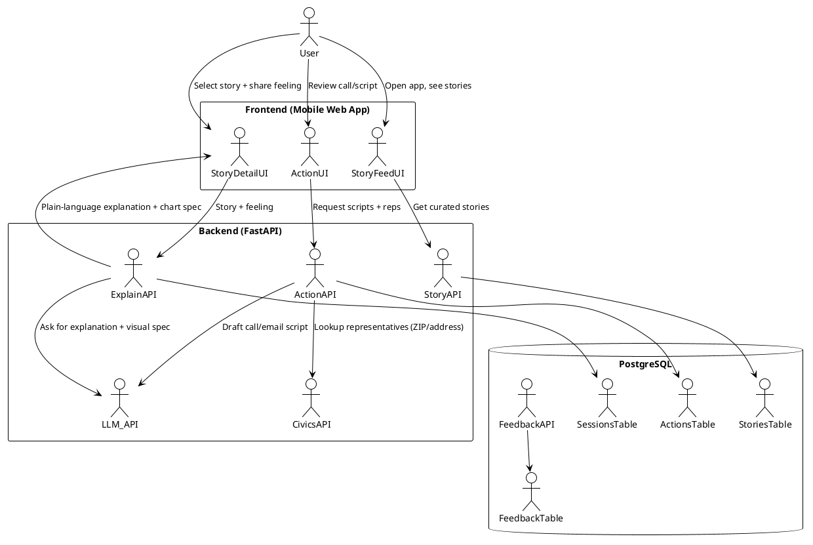

Here’s an updated **MVP architecture** that matches the docs + “story → feeling → clarity → visual → action” flow, and trims out anything we don’t need yet.

---

## 1. MVP scope (aligned with docs)

Flow for v0:

1. User opens app → sees **3–5 “stories of the week”** (economy, corruption, environment…).
2. Taps a story → we ask **“How does this make you feel?”** (chips: angry / worried / hopeful / confused).
3. LLM explains: **what’s happening, who’s benefiting, who’s hurt, what levers exist**.
4. UI shows a **simple visual** (quality-of-life vs corporate/political trajectory – not exact data, just trendlines).
5. User taps **“Take action”** → generates **call or message script** to their reps.

For MVP, sources can be:

* Hand-curated list in the admin panel **or**
* A simple “Story import” from Ground News or a similar API (no full news ingestion pipeline yet).

---

## 2. Slimmed-down MVP architecture

**Key change from previous spec**:
No full knowledge graph, no vector DB, no analytics DB, no Ollama in v0.1.

We keep it to:

* **Frontend:** React / Next.js + Tailwind (mobile-first).
* **Backend API:** FastAPI.
* **DB:** PostgreSQL (stories, sessions, actions, basic feedback).
* **LLM:** External API (OpenAI/Anthropic) for:

  * Explanation
  * Visual spec generation (config, not image)
  * Call/message drafting
* **Optional external APIs:**

  * Ground News (or equivalent) for story metadata.
  * Google Civic Information API for rep lookup (by ZIP or address).

---

## 3. Updated MVP diagram

---

## 4. MVP components

### 4.1 Frontend (Next.js / React + Tailwind)

**Screens:**

1. **Story Feed**

   * Cards with: title, 1–2 line summary, tags, “est. impact” chips (workers / environment / democracy).
   * Tap → Story Detail.

2. **Story Detail**

   * Story context (short).
   * “How do you feel about this?” → emotion chips.
   * On selection → call `ExplainAPI`.

3. **Explanation + Visual**

   * Text explanation from LLM (max ~200–300 words).
   * Visual component:

     * Simple 2–3 line chart: “Workers QoL”, “Corporate Power”, optionally “Political Risk”.
     * The **shape** (up/down/flat) comes from a small JSON chart spec from the LLM or template.

4. **Action Screen**

   * Shows:

     * “Here’s what you can do:” → call / email / post.
     * Rep list (name, office, phone) from Civics API.
     * Primary script + “short version”.
   * One-tap copy / “I called” / “I messaged” → trigger feedback.

5. **Feedback UI**

   * After explanation & action:

     * “Did this make sense?” → ✅ / 🤔
     * “Did you act?” → Yes/No.
   * Sends to `FeedbackAPI`.

---

### 4.2 Backend (FastAPI)

**Core endpoints:**

* `GET /stories`

  * Returns active stories for the week.

* `GET /stories/{id}`

  * Full story details + any pre-authored notes.

* `POST /explain`

  * Input: `story_id`, `feeling`, optional `user_zip`.
  * Flow:

    1. Load story + metadata from Postgres.
    2. LLM prompt:

       * Explain in plain language.
       * Output also a **chart spec** (e.g. JSON like `{ "lines": [{ "label": "Workers QoL", "trend": "down" }, ...] }`).
    3. Save `session` record (story, feeling, explanation hash).

* `POST /action`

  * Input: `story_id`, optional `user_address` or `zip`.
  * Flow:

    1. Lookup reps via Civics API.
    2. Ask LLM for:

       * Call script.
       * Email script.
       * SMS-style micro-script.
    3. Return reps + scripts.
    4. Persist to `actions` table.

* `POST /feedback`

  * Input: `session_id`, `made_sense` (bool), `took_action` (bool).
  * Store minimal anonymous metrics.

---

### 4.3 Data model (MVP)

**stories**

* `id`
* `title`
* `slug`
* `summary_short`
* `summary_long`
* `source_url`
* `source_partner` (e.g., `ground_news`, `manual`)
* `topic` (economy, corruption, environment…)
* `impact_profile` (JSON – e.g. `{ "workers_qol": "down", "corporate_power": "up", "timeline": "5y" }`)
* `default_district_scope` (national/state/local)
* `is_active`
* timestamps

**sessions**

* `id`
* `story_id`
* `feeling` (angry / worried / confused / hopeful)
* `explanation_text`
* `visual_spec` (JSON chart spec returned by LLM or templated)
* timestamps

**actions**

* `id`
* `session_id`
* `reps` (JSON – names/phones/emails)
* `call_script`
* `email_script`
* `sms_script`
* timestamps

**feedback**

* `id`
* `session_id`
* `made_sense` (bool / null)
* `took_action` (bool / null)
* timestamps

No user auth needed for earliest tests; you can add optional `client_hash` later if you want basic cohort tracking.

---

## 5. What we explicitly defer (post-MVP)

To keep v0 tight:

* ❌ No Qdrant / vector DB.
* ❌ No generalized knowledge graph (only per-story context).
* ❌ No Ollama/local models (external LLM only).
* ❌ No heavy analytics pipelines; just raw Postgres tables and maybe a simple admin dashboard.
* ❌ No A/B tone testing.

Those can all be added in “v1.5” once **story → feeling → clarity → visual → action** is proven.

---

If you’d like, next step I can draft:

* A **minimal FastAPI route skeleton** for `/stories`, `/explain`, `/action`, `/feedback`
  or
* A **prompt template** for the LLM that outputs both explanation text and the simple chart spec.
